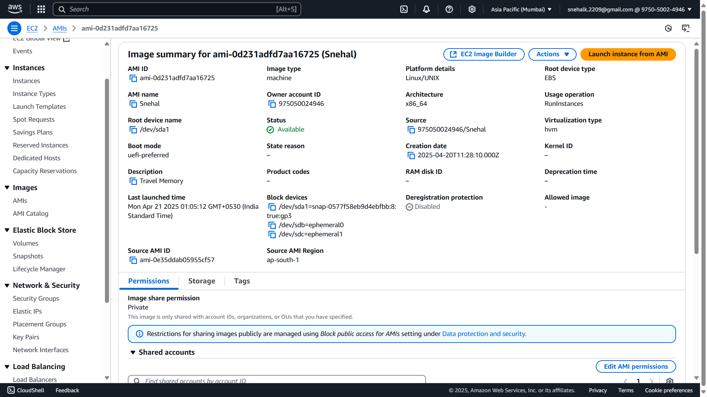
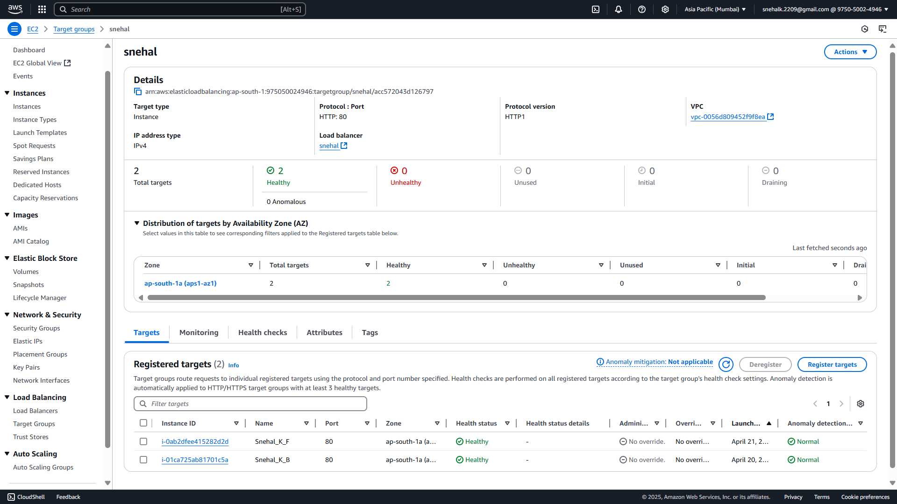
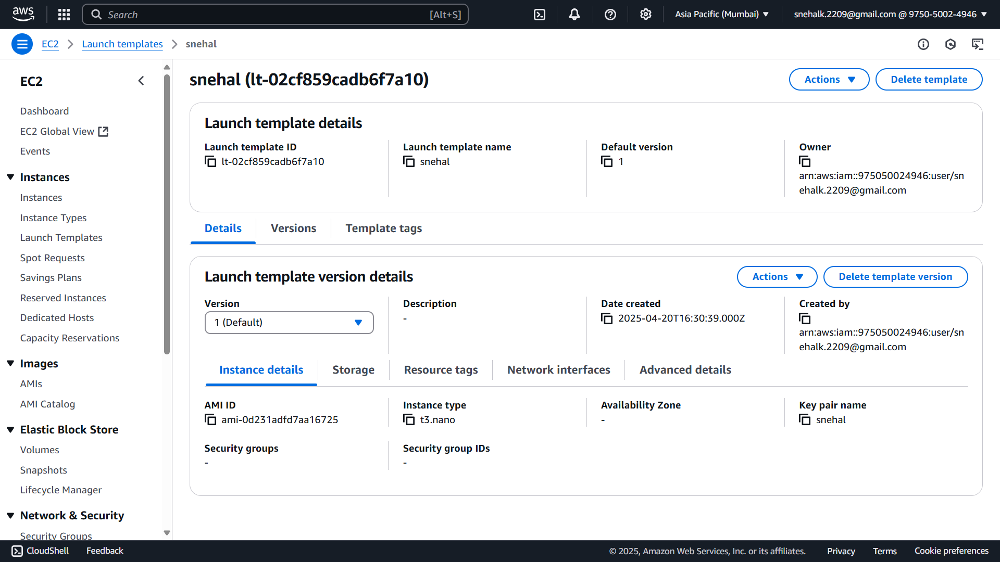
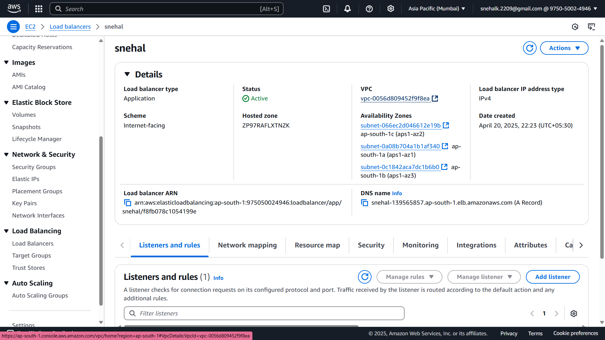
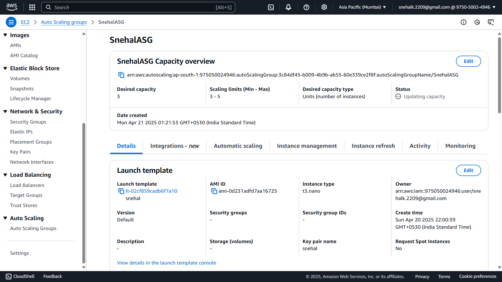

# TravelMomery

 

TravelMomery is a web application designed to help users document and share their travel experiences. It allows users to store travel memories, upload photos, and manage their travel data efficiently.

---

## Table of Contents
1. [Features](#features)
2. [Getting Started](#getting-started)
   - [Backend Setup](#backend-setup)
   - [Frontend Setup](#frontend-setup)
3. [Working on AWS](#working-on-aws)
4. [Technologies Used](#technologies-used)
5. [Contributing](#contributing)
6. [License](#license)

---

## Features
- Connects to MongoDB Atlas for secure and scalable data storage.
- Backend powered by Node.js for robust server-side operations.
- Frontend built with React for a dynamic and responsive user interface.
- Easy setup with `.env` configuration for both backend and frontend.

---

## Getting Started

### Backend Setup
1. Create a `.env` file in the backend directory and configure MongoDB Atlas.
   ```
   MONGO_URI=<Your MongoDB Atlas Connection String>
   ```
   

2. Install dependencies:
   ```
   npm install
   ```

3. Start the backend server:
   ```
   node backend/index.js
   ```
   

4. Add data to the database:
   

5. Verify the output:
   

---

### Frontend Setup
1. Create a `.env` file in the frontend directory with the following content:
   ```
   REACT_APP_BACKEND_URL=http://localhost:3001
   ```

2. Install dependencies:
   ```
   npm install
   ```

3. Start the frontend server:
   ```
   npm start
   ```
   

---

## Working on AWS

### Step 1: Create Instances
- Create two instances: one for the backend and one for the frontend.
- Configure the following:
  - **Name**: `Snehal_K_B` (Backend Server), `Snehal_K_F` (Frontend Server)
  - **AMI**: Ubuntu 24.04 LTS
  - **Instance Type**: t3.nano
  - **Key Pair**: `snehal` (Create a new one if you don't have it)
  - **Network Settings**: Configure VPC, Subnet, enable `Auto-assign public IP`, and set Security Group to open ports 80, 443, and 22 from `0.0.0.0/0`.

### Step 2: Configure Instances
- Connect to the instances and install Node.js, Nginx.
- Clone the TravelMomery repository and follow the backend and frontend setup instructions.

### Step 3: Configure Nginx Reverse Proxy
Edit the Nginx configuration file:
```bash
sudo nano /etc/nginx/nginx.conf
```
Add the following configuration:
```nginx
server {
    listen 80;
    server_name _;
    location / {
        proxy_pass http://localhost:<Port>;
    }
}
```
Restart Nginx:
```bash
sudo systemctl restart nginx
```

### Step 4: Create AMI for Both Instances


### Step 5: Configure Target Group


### Step 6: Launch Template


### Step 7: Load Balancer


### Step 8: Auto Scaling Group


### Step 9: Access the Application
Copy the DNS of the Load Balancer and check your website.

---

## Technologies Used
- **Backend**: Node.js, Express.js
- **Database**: MongoDB Atlas
- **Frontend**: React.js

---

