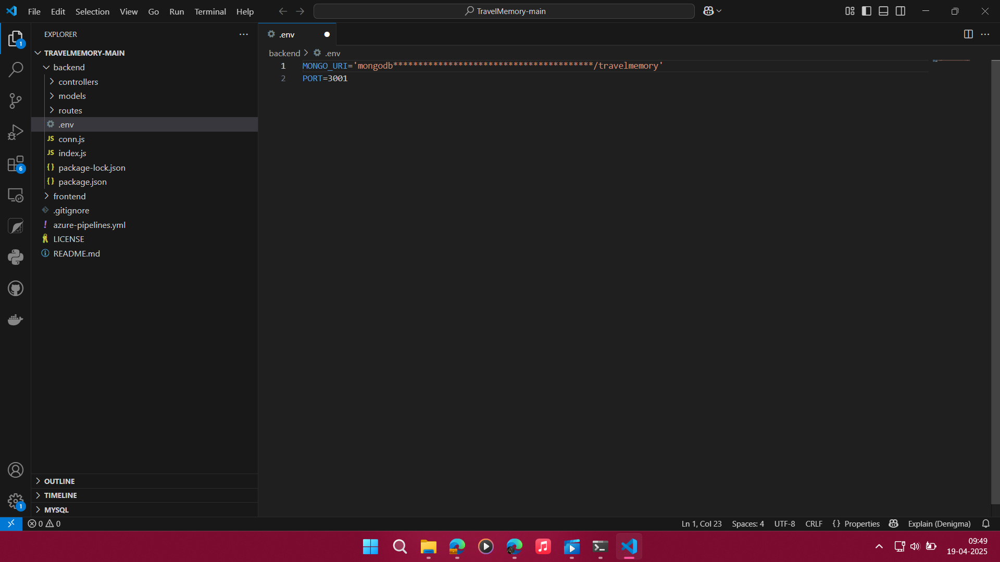
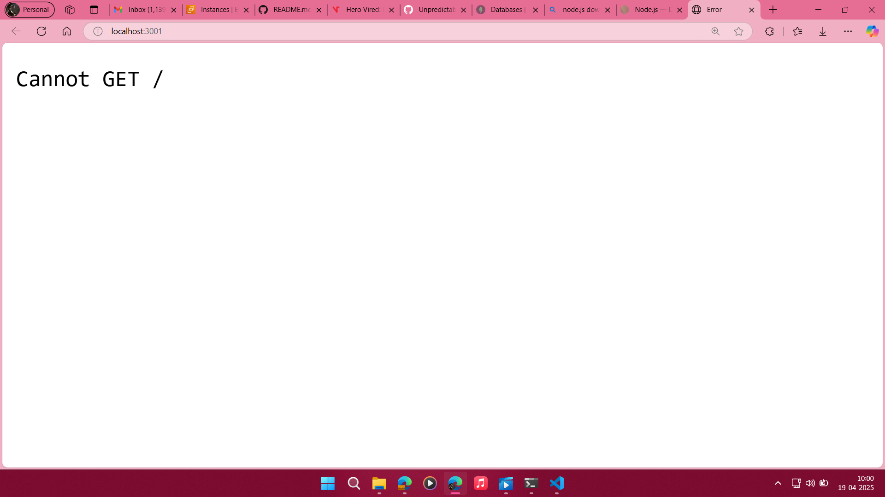
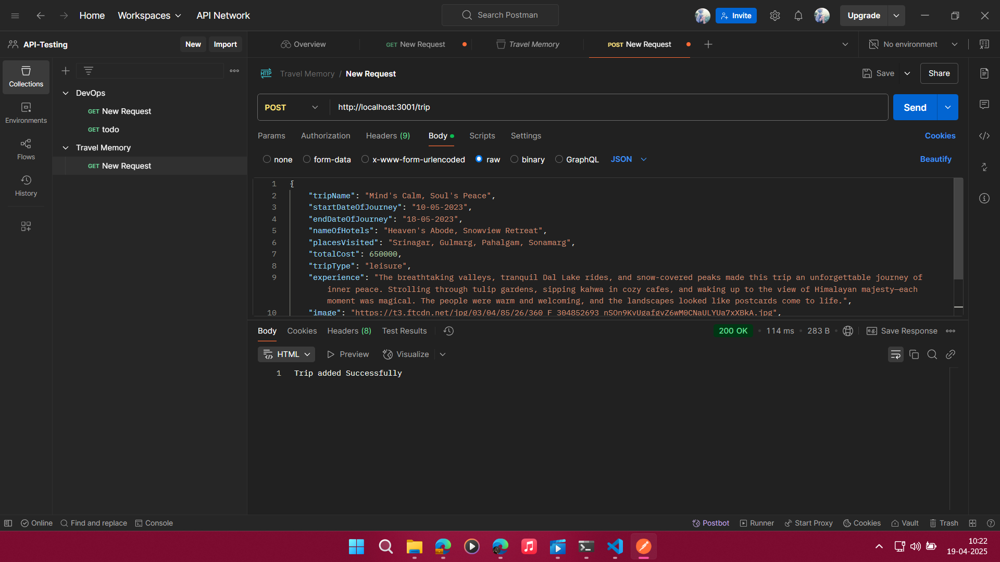
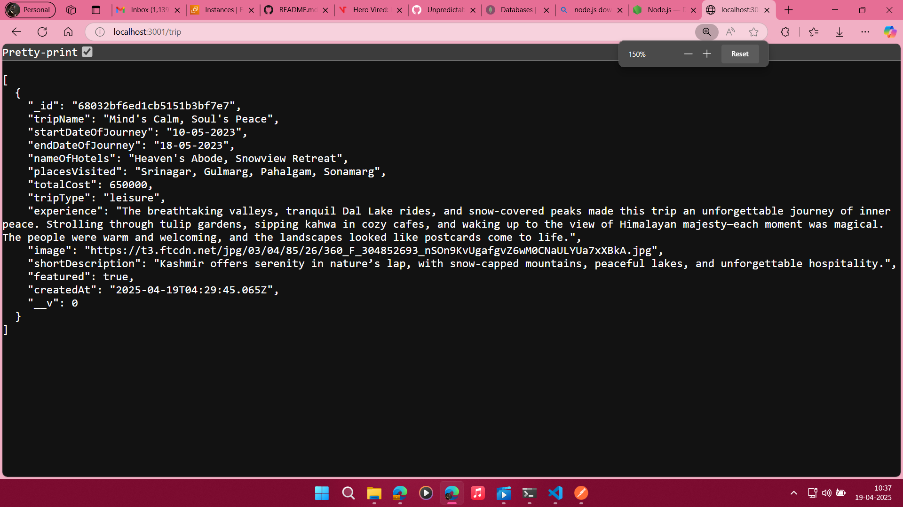
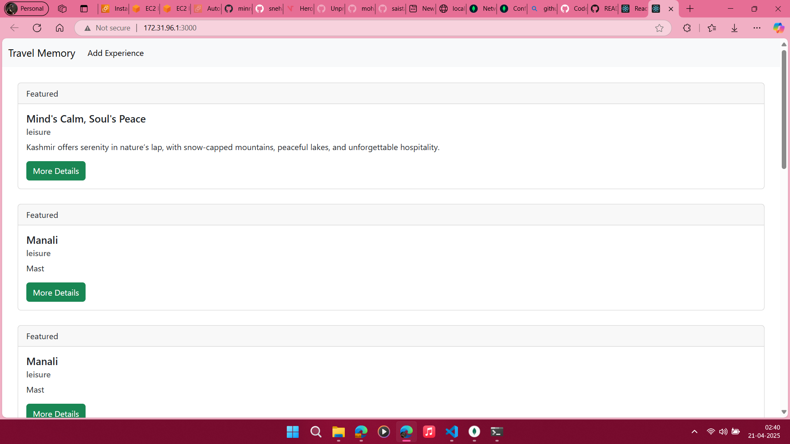

# TravelMomery
## Created .env file and configure MongoDB Atlas

Successfully Imported packjes from Backend Directory **npm install** 
Running Backend **node backend/index.js** 

added Data in Database:

Output

## FrontEnd 
1. created .env file inside frontend Directory ***REACT_APP_BACKEND_URL=http://localhost:3001*** , 
2. Installed all packges
3. `npm start`
